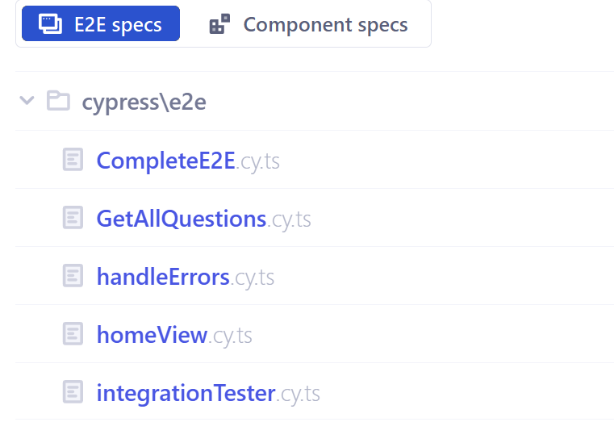
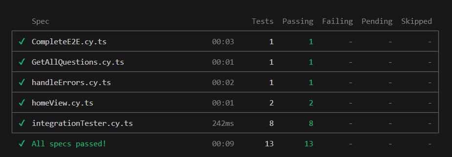

## ✅ Testing Overview`

## 

## 

## **Achieved Goals**

1. **E2E Tests**

   - A **basic E2E test** has been implemented to test navigation and modal component display on the home page.
   - A **complete E2E test** has been created without mocking, covering frontend, backend, and database. The test verifies that a new question can be created, validated in the backend, and displayed correctly in the frontend.

2. **Component Tests**

   - Two component tests have been implemented. The `<Answers />` and `<QuestionComponent />` components are tested with mock data, and their functionality is verified without communicating with the backend.

3. **Integration Tests**

   - Three integration tests have been performed using `cy.request`:

     - A **GET test** that fetches data from the backend.
     - A **POST test** that sends data to the backend and verifies that it is saved correctly.
     - A **CRUD test** that verifies that all CRUD operations function correctly.

4. **Mocking with Cypress Fixtures**

   - A GET request to the backend has been mocked using a JSON file in `cypress/fixtures`. The test verifies the display of data in the frontend with simulated API responses.

5. **TypeScript and Cypress Requirements**

   - All tests are implemented in TypeScript (including TSX where needed). No JavaScript or JSX has been used.
   - The tests are created exclusively with Cypress and follow consistent code formatting guidelines.

---

## **E2E Tests**

### **1. E2E Simple Test**

**File:** `cypress/e2e/HomeView.cy.ts`

The test verifies basic functionality on the home page:

- **Home page displays correct heading:** The test checks that the heading "Welcome to Trivia" is displayed on the home page.
- **Button text and function:** The test ensures that the "See Questions" button opens a modal with the title "All Questions".

The test confirms that the home page and basic navigation work as expected.

---

### **2. Complete E2E Test Without Mocking**

**File:** `cypress/e2e/CompleteE2E.cy.ts`

The test verifies the full E2E flow:

- **Create a new question via frontend:** The test fills out the form to add a question and submits it.
- **Verification in backend/database:** A GET request ensures that the question has been saved correctly in the database.
- **Verification in frontend:** The test checks that the question is displayed in the list.

The test ensures that frontend, backend, and database work together in a complete scenario.

---

## **Integration Tests Without Mock Data to API**

**File:** `cypress/e2e/IntegrationTester.cy.ts`

Three different tests:

- **GET test:** Fetches data from the API and verifies that the structure is correct.
- **POST test:** Adds a new question and checks that it is saved in the database. **NOTE:** The test requires changing the question title or deleting the question from the database to avoid duplication.
- **Full CRUD test:** Combines GET, POST, PATCH, and DELETE to verify the complete lifecycle of a question.

An additional test for Errors:

**File:** `cypress/e2e/handleErrors.cy.ts`

An integration test that verifies that the frontend correctly handles a backend error when creating a question. The backend response is mocked with status code 500, and the test checks that an error message is displayed in the UI.

---

## **Component Tests with Mock Data**

### <Answers />

**File:** `cypress/component/Answers.cy.tsx`

The test verifies:

- Four answer buttons are displayed correctly.
- Correct answer is marked in green, incorrect answers are marked in red.
- All buttons are disabled after an answer is selected.

### <QuestionComponent />

**File:** `cypress/component/QuestionComponent.cy.tsx`

The test verifies:

- The question text is displayed correctly.
- The correct answer is displayed as expected based on the mock data.

---

## **Mocking with Fixtures**

### **GET Request to Backend:**

**File:** `cypress/e2e/GetAllQuestions.cy.ts`

The test uses mock data from `data.json` and verifies that the frontend handles the data correctly:

1. **Mocked GET request:** Simulates API response.
2. **Verification of data display:** Checks that the list of questions is displayed correctly.
3. **Verification of UI components:** Ensures that the delete and update buttons, as well as form fields and labels, are rendered correctly.

---

## **Other Notes**

- Make sure that the database is properly created locally.
- The backend server must be running before starting the frontend.
- The frontend must be running before starting Cypress testing.

---
