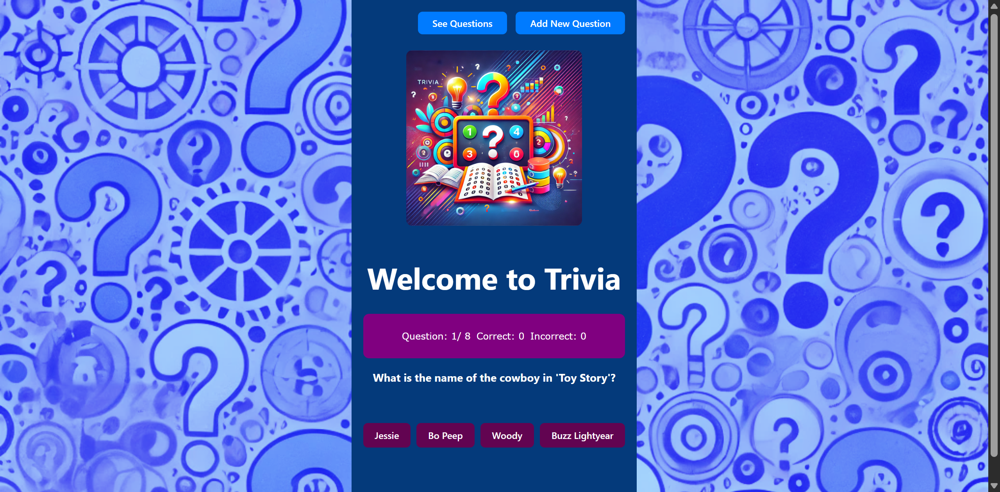
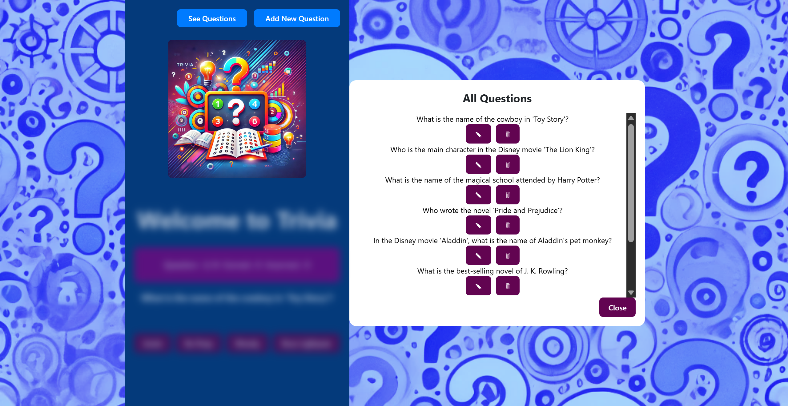
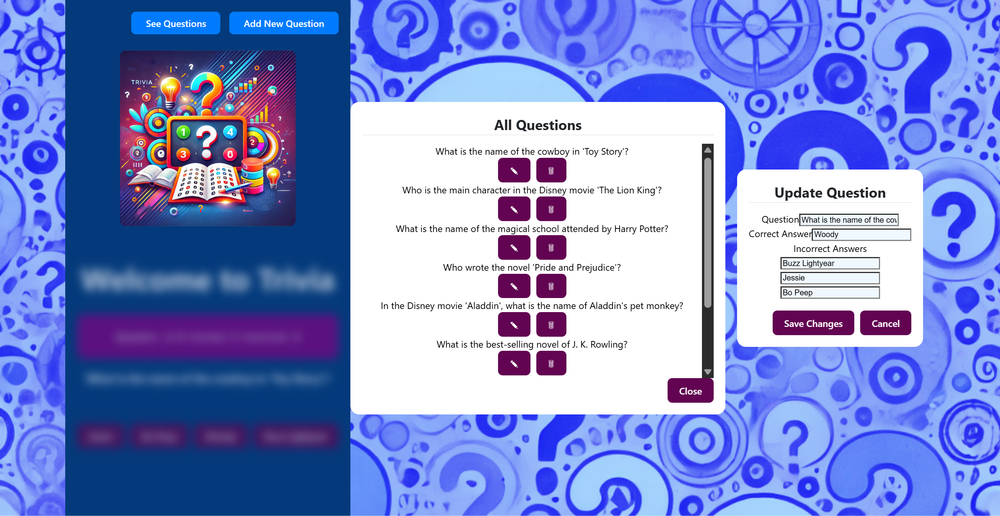
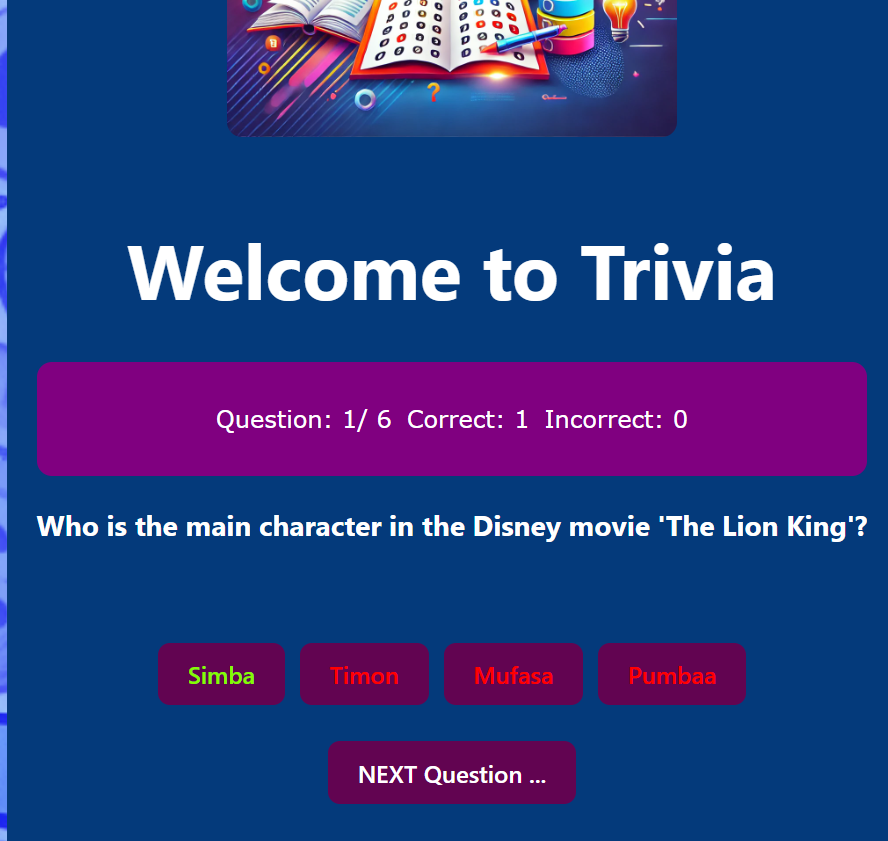
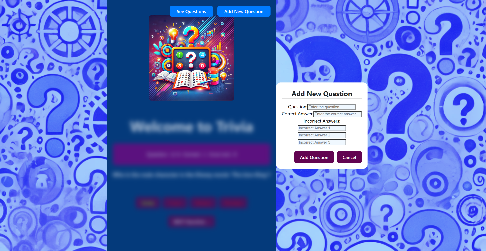
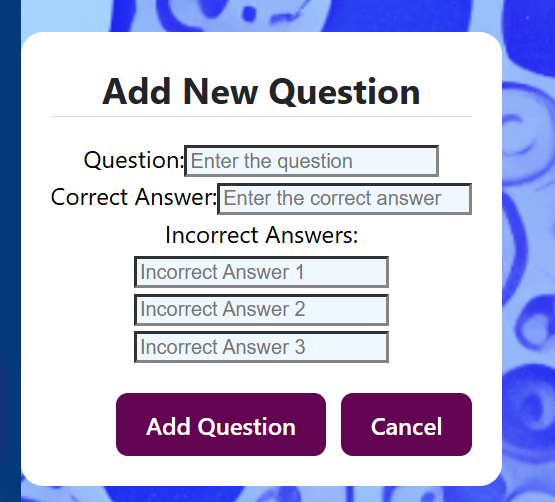

# Trivia-App TESTER and TYPESCRIPT

## Labb 2: TypeScript och Cypress Testing

### Ursula Vallejo Janne | November 2024

### 📋 Project Summary

This project is a **fullstack Trivia web application** developed as part of the course requirements.
The app allows users to explore trivia questions, create new ones, update them, and delete them — supporting a complete CRUD workflow.

The application consists of:

- **Frontend** built with React and TypeScript (using TSX)
- **Backend** implemented with Node.js, Express, and TypeScript
- **PostgreSQL database** for persistent storage of trivia questions
- **End-to-End (E2E) and component tests** implemented with Cypress and TypeScript

Key features:

- Display a list of trivia questions with answers
- Add new questions through a user-friendly form
- Edit and delete existing questions
- Responsive UI, compatible with both desktop and mobile devices
- Error handling for API calls
- Automated tests covering frontend, backend, and database

Testing:

- Full E2E tests for user interaction and complete flow verification (frontend + backend + database)
- Component tests verifying UI behavior with mock data
- Integration tests verifying direct API behavior
- Use of Cypress Fixtures for mocking API responses
- Test-Driven Development (TDD) applied to selected components
- Behavior-Driven Development (BDD) applied with Given-When-Then approach in specific tests
- UML diagrams created to describe key parts of the project architecture
- Code coverage measured and reported
- Automated test execution with GitHub Actions on each `git push`

The project was built entirely with **TypeScript** — no JavaScript/JSX used.
Special focus was given to test coverage and testing best practices.

This project fulfills both the **functional** and **testing** requirements for the course, with advanced coverage and automation in place.


https://github.com/user-attachments/assets/329a43cf-5d60-4463-980d-a12a4a887777


---

### 🛠️ Technologies Used

- **Frontend**

  - React (with TypeScript and TSX)
  - React Hooks for state management
  - React Bootstrap for responsive UI components
  - CSS Modules for styling

- **Backend**

  - Node.js with Express (written in TypeScript)
  - REST API for CRUD operations

- **Database**

  - PostgreSQL for persistent data storage

- **Testing**
  - Cypress for

---

### General view:

## [](main-view)

## [](allQuestions-view)

## [](update-Questions-view)

## [](next-Questions-view)

## [](add-Questions-view)

## [](add-Questions-view-detail)

## Starta applikationen

### **Frontend** (localhost:5173):

**Terminal 1:**

```bash
$ npm install
$ npm run dev
```

**Terminal 2:**

```bash
$ npx cypress open
```

### **Backend** (localhost:3000):

**Kör i watch mode:**

```bash
$ npm install
$ npm run dev
```

### **Databas** - PostgreSQL via pg:

**Terminal:**

```bash
$ psql --username=postgres
CREATE DATABASE trivia;
\c trivia;
```

Create Questions and content ( db.sql)
**>>Kör in backend/db.sql för att skapa tabeller.**

---

## **Uppnådda mål**

1. **E2E-tester**

   - Ett **grundläggande E2E-test** har implementerats för att testa navigering och visning av modalkomponenter på startsidan.
   - Ett **komplett E2E-test** har skapats utan mocking, som täcker frontend, backend och databas. Testet kontrollerar att en ny fråga kan skapas, verifieras i backend och visas korrekt i frontend.

2. **Komponenttester**

   - Två komponenttest har implementerats. `<Answers />`- och `<QuestionComponent />`-komponenterna testas med mockdata, och deras funktionalitet verifieras utan kommunikation med backend.

3. **Integrationstester**

   - 3 integrationstester har genomförts med `cy.request`:
     - Ett **GET-test** som hämtar data från backend.
     - Ett **POST-test** som skickar data till backend och verifierar att den sparas korrekt.
     - Ett **CRUD-test** som verifierar att alla CRUD funkar korrekt.

4. **Mocking med Cypress Fixtures**

   - Ett GET-anrop mot backend har mockats med hjälp av en JSON-fil i `cypress/fixtures`. Testet verifierar visningen av data i frontend med simulerade API-svar.

5. **Krav på TypeScript och Cypress**
   - Alla tester är implementerade i TypeScript (inklusive TSX där det behövs). Ingen JavaScript eller JSX har använts.
   - Testerna är skapade enbart med Cypress och följer riktlinjerna för enhetlig kodformattering.

---

---

## **E2E-tester**

### **1. E2E Simple Test**

**Fil:** `cypress/e2e/HomeView.cy.ts`

Testet verifierar grundläggande funktioner på hemsidan:

- **Startsidan visar korrekt rubrik:** Testet kontrollerar att rubriken "Welcome to Trivia" visas på startsidan.
- **Knappens text och funktion:** Testet säkerställer att knappen "See Questions" öppnar en modal med rubriken "All Questions".

Testet bekräftar att startsidan och grundläggande navigering fungerar som förväntat.

---

### **2. Komplett E2E-test utan mock**

**Fil:** `cypress/e2e/CompleteE2E.cy.ts`

Testet verifierar hela E2E-flödet:

- **Skapa en ny fråga via frontend:** Testet fyller i formuläret för att lägga till en fråga och skickar det.
- **Verifiering i backend/databas:** En GET-förfrågan säkerställer att frågan sparats korrekt i databasen.
- **Verifiering i frontend:** Testet kontrollerar att frågan visas i listan.

Testet säkerställer att frontend, backend och databasen fungerar tillsammans i ett komplett scenario.

---

## **Integrationstester utan mock data till API**

**Fil:** `cypress/e2e/IntegrationTester.cy.ts`

Tre olika tester:

- **GET-test:** Hämtar data från API:t och verifierar att strukturen är korrekt.
- **POST-test:** Lägger till en ny fråga och kontrollerar att frågan sparas i databasen. **OBS:** Testet kräver att frågans titel ändras eller att frågan raderas från databasen för att undvika duplicering.
- **Fullständigt CRUD-test:** Kombinerar GET, POST, PATCH och DELETE för att verifiera hela livscykeln för en fråga.

En tester för Errors:

**Fil:** `cypress/e2e/handleErrors.cy.ts`

Testar en integrationstest som verifierar att frontend hanterar ett backend-fel korrekt vid skapande av en fråga. Backend-svaret mockas med statuskod 500, och testet kontrollerar att ett felmeddelande visas i användargränssnittet.

---

## **Komponenttester med mockdata**

### <Answers />

**Fil:** `cypress/component/Answers.cy.tsx`

Testet verifierar:

- Fyra svarsknappar visas korrekt.
- Rätt svar markeras grönt, och felaktiga svar markeras rött.
- Alla knappar inaktiveras efter att ett svar har valts.

### <QuestionComponent />

**Fil:** `cypress/component/QuestionComponent.cy.tsx`

Testet verifierar:

- Frågetexten visas korrekt.
- Rätt svar visas som förväntat baserat på mockdata.

---

## **Mocking med fixtures**

### **GET-anrop mot backend:**

**Fil:** `cypress/e2e/GetAllQuestions.cy.ts`

Testet använder mockad data från `data.json` och verifierar att frontend hanterar datan korrekt:

1. **Mockad GET-förfrågan:** Simulerar API-svar.
2. **Verifiering av datavisning:** Kontrollerar att frågelistan visas korrekt.
3. **Verifiering av UI-komponenter:** Säkerställer att delete- och update-knapparna samt formulärets fält och etiketter är korrekt renderade.

---

## **Övrigt**

- Se till att databasen är korrekt skapad lokalt.
- Backend-servern måste köras innan frontend startas.
- Frontend måste vara igång innan Cypress-testning påbörjas.

---

### 📄 [Detailed Information of the Project](Detail_Info.md)

---
